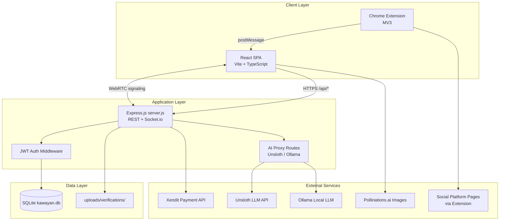
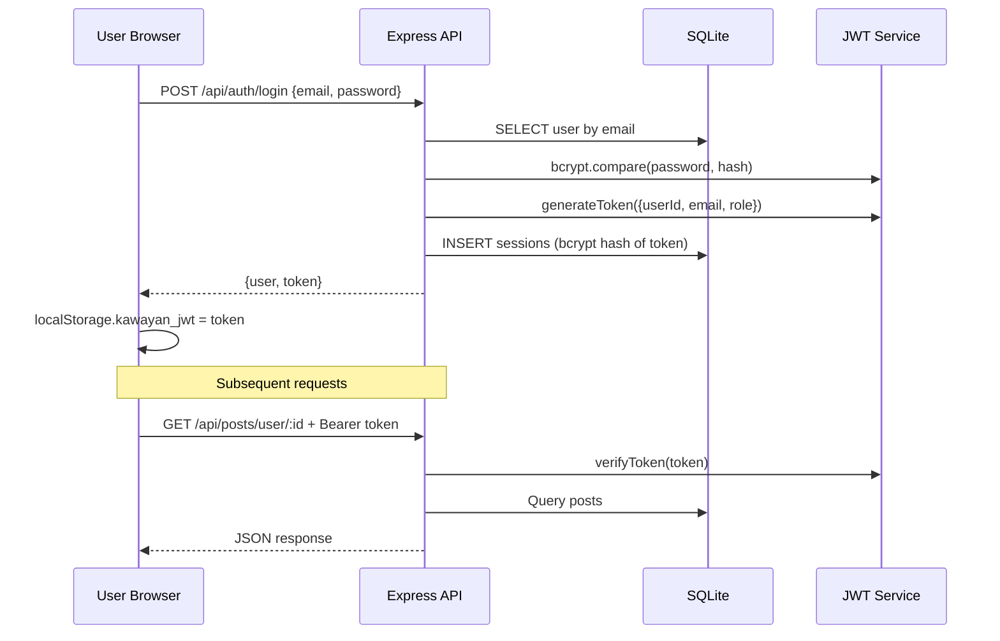
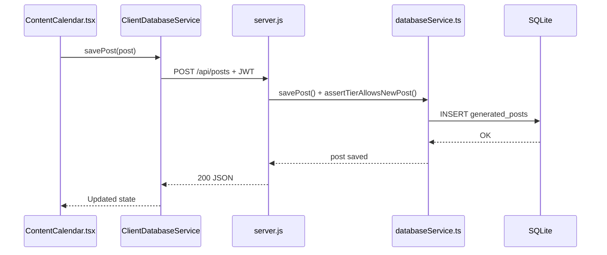
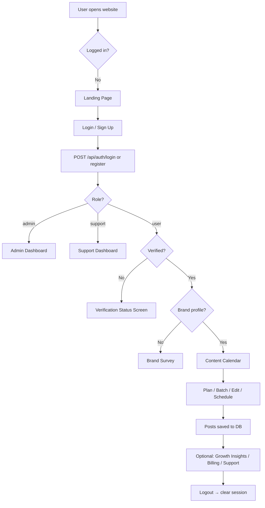
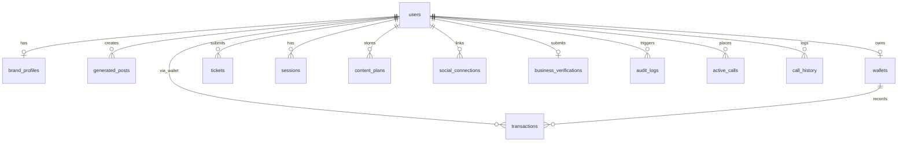
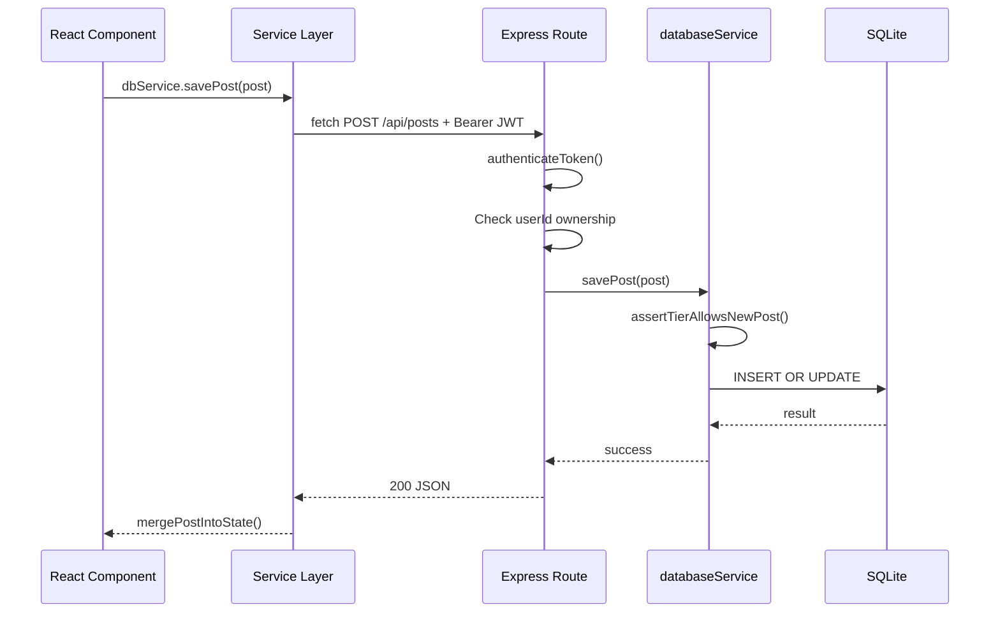

# Kawayan AI — Complete System Guide

## Table of Contents

1. [Introduction](#1-introduction)
2. [System Overview](#2-system-overview)
3. [Relationship to the Capstone Paper](#3-relationship-to-the-capstone-paper)
4. [System Architecture](#4-system-architecture)
5. [Complete System Flow](#5-complete-system-flow)
6. [Module-by-Module Explanation](#6-module-by-module-explanation)
7. [Database Documentation](#7-database-documentation)
8. [Folder Structure](#8-folder-structure)
9. [Code Flow](#9-code-flow)
10. [User Guide](#10-user-guide)
11. [Administrator Guide](#11-administrator-guide)
12. [Security Features](#12-security-features)
13. [Technologies Used](#13-technologies-used)
14. [Algorithms and Business Logic](#14-algorithms-and-business-logic)
15. [Error Handling](#15-error-handling)
16. [Testing](#16-testing)
17. [Future Improvements](#17-future-improvements)
18. [Frequently Asked Questions](#18-frequently-asked-questions-faq)
19. [Glossary](#19-glossary)
20. [Conclusion](#20-conclusion)

---

## 1. Introduction

### 1.1 Purpose of the System

**Kawayan AI** is a web-based social media content management platform designed for **Filipino Small and Medium Enterprises (SMEs)**. It helps business owners who lack dedicated marketing teams to:

- Plan monthly social media content with AI assistance
- Generate **Taglish** (Filipino–English) captions and images
- Schedule posts on an interactive editorial calendar
- Pay for premium features through **Xendit** (GCash, Maya, cards)
- Track engagement metrics from Facebook, Instagram, and TikTok
- Receive technical and billing support through an integrated help desk

The system reduces the time, cost, and expertise barrier for SMEs to maintain a consistent social media presence.

### 1.2 Project Overview

Kawayan combines a **React** single-page application, an **Express.js** REST API, and a **SQLite** database into one deployable product. AI content generation is powered primarily by an **Unsloth LLM proxy** (with optional local **Ollama** fallback). Payments flow through **Xendit**. A **Chrome browser extension** syncs live platform insights into the Growth Insights Dashboard.

The visual design follows an **Organic Wabi-Sabi** design system: forest green (`#2B5748`), soft sage (`#9CB080`), Fraunces serif headings, and Nunito/Quicksand UI text.

### 1.3 Objectives

| # | Objective | System implementation |
|---|-----------|----------------------|
| O1 | Automate SME social content planning | AI monthly plan + batch generation (`generateContentPlan`, `handleBatchGenerate`) |
| O2 | Provide an interactive editorial calendar | Schedule-X calendar with day panel (`ContentCalendar.tsx`) |
| O3 | Enforce fair usage via subscription tiers | Trial 8 posts / Pro 16 posts (`utils/tierLimits.ts`) |
| O4 | Monetize via wallet and add-on posts | Xendit top-up + ₱150 add-on module |
| O5 | Deliver growth analytics | Growth Insights Dashboard + browser extension |
| O6 | Support MSME onboarding with verification | Business document upload + admin approval queue |
| O7 | Provide integrated customer support | Help desk widget, tickets (#1001+), live WebRTC calls |
| O8 | Enable administrative governance | Admin panel: users, billing, audit logs, retention stats |

### 1.4 Scope

**In scope (implemented):**

- User registration, login, brand survey, business verification
- AI content planning, batch creation, single-post editing
- Calendar scheduling (Draft → Scheduled → Published)
- Wallet, Xendit payments, Pro subscription (₱499/mo)
- Growth Insights with extension sync
- Help desk (tickets, categories, calls)
- Admin and support dashboards
- Role-based access (user, support, admin)

**Out of scope / partial:**

- Full OAuth for all social platforms (username + extension sync is primary path)
- Xendit webhook handler (route exists as stub; manual/admin verification available)
- Native mobile apps
- Automated posting to platforms without browser extension assistance

### 1.5 Intended Users

| Role | Description | Default test account |
|------|-------------|---------------------|
| **SME User** | Café, bakery, retail owner creating content | `cafe@kawayan.ph` / `Password123!` |
| **Support Agent** | Handles tickets and live calls | `support@kawayan.ph` / `Support123!` |
| **Administrator** | Manages users, payments, verifications | `admin@kawayan.ph` / `Admin123!` |

See `md/ACCOUNTS.md` for the full seeded account list.

---

## 2. System Overview

### 2.1 High-Level Explanation

A user registers, uploads business verification documents, and completes a brand survey. Once an admin approves verification, the user accesses the **Content Calendar**. They describe a monthly strategy; AI generates content ideas assigned to calendar days. **Batch Create** produces captions and images for all slots. Users edit posts in a right-side panel, schedule them, and optionally publish via the browser extension.

Billing uses a **prepaid wallet** funded through **Xendit**. Pro users get 16 posts per month; trial users get 8. Extra posts beyond the cap cost **₱150** each (add-on module).

### 2.2 Main Features

| Feature | Description |
|---------|-------------|
| Interactive Editorial Calendar | Month grid/list, day click panel, + add-on control |
| AI Content Planning | Taglish captions, image prompts, virality scoring |
| Batch Generation | Up to 8 or 16 posts with captions + images in one run |
| Tier Limits | FREE=8, PRO=16 posts per calendar month |
| Add-on Posts | ₱150 paid supplemental post (`addon-` ID bypasses cap) |
| Xendit Billing | Wallet top-up, Pro subscription, transaction history |
| Growth Insights | Engagement metrics, charts, digital ROI estimate |
| Browser Extension | Sync FB/IG/TikTok stats; assist posting |
| Business Verification | Document upload; admin approve/reject |
| Help Desk | Technical/Billing tickets, AI chat, WebRTC calls |
| Admin Portal | Users, billing verification, growth/retention charts |

### 2.3 Problems the System Solves

| Problem | Kawayan solution |
|---------|------------------|
| SMEs lack time for consistent posting | AI batch generation + calendar scheduling |
| Hiring social media managers is expensive | Self-service AI at tiered subscription cost |
| Content does not match Filipino audience | Taglish generation tuned to brand profile |
| No single view of multi-platform schedule | Unified editorial calendar |
| Payment friction for micro-services | Xendit wallet (GCash/Maya familiar to PH users) |
| No visibility into post performance | Growth Insights + extension sync |
| Support scattered across channels | Integrated help desk with categorized tickets |

### 2.4 Overall Architecture



---

## 3. Relationship to the Capstone Paper

This section maps **typical Capstone thesis chapters** to what Kawayan implements. Adjust chapter numbers to match your group's actual paper.

### 3.1 Research Objectives ↔ System Features

| Research objective (typical) | Feature that fulfills it | Why it exists |
|-----------------------------|--------------------------|---------------|
| Design a content tool for PH SMEs | Brand survey + Taglish AI | Personalizes output to local businesses |
| Automate scheduling | `content_plans` + calendar day assignment | Reduces manual calendar work |
| Implement tiered SaaS model | 8/16 post limits + Pro plan | Sustainable freemium business model |
| Integrate local payments | Xendit wallet | PH-standard e-wallet checkout |
| Measure digital ROI | Growth Insights ROI card | Connects spend to engagement outcomes |
| Ensure trustworthy onboarding | Business verification | Reduces fraud; aligns with MSME registration |
| Provide user support | Help desk + ticket categories | Operational requirement for real deployment |

### 3.2 Methodology ↔ Development Approach

| Methodology element | Implementation evidence |
|--------------------|-------------------------|
| Agile / iterative development | Git history, modular React components |
| Prototyping | `DemoPage.tsx`, organic UI iterations |
| Requirements-driven design | `md/FEATURE_CHECKLIST.md` traceability |
| User-centered design | Wabi-Sabi UI, sliding panel vs modal |
| Hybrid AI strategy | Cloud Unsloth + local Ollama proxy |

### 3.3 System Requirements ↔ Features

See **Section 6** and `md/FEATURE_CHECKLIST.md` for the full requirements matrix (22 functional items, all implemented or enhanced).

### 3.4 Design ↔ UI/UX Decisions

| Design decision | Rationale |
|----------------|-----------|
| Full-screen calendar | Paper requirement: interactive editorial calendar |
| Right sliding panel | Non-disruptive editing vs popup modals |
| `+` control on empty days | Less visual noise than "ADD" text |
| Organic Wabi-Sabi theme | Capstone branding; readable for long sessions |
| Role-separated dashboards | Admin/support should not see SME calendar by default |

### 3.5 Implementation ↔ Tech Stack

Documented in **Section 4** and **Section 13**. Primary stack: React 19, Express 5, SQLite, JWT, Xendit, Socket.io.

### 3.6 Testing ↔ Validation Activities

Documented in **Section 16**. Includes `systemTest.ts`, `dbTest.ts`, manual UAT scripts in `md/TESTING_GUIDE.md`.

### 3.7 Evaluation ↔ Metrics

| Metric | Where measured |
|--------|----------------|
| User growth | Admin → User Growth chart |
| Retention | Admin → 30-day retention % + bar chart |
| Engagement | Growth Insights per platform |
| Digital ROI | Insights ROI card (reach value vs wallet spend) |
| Content output | Posts created count (admin stats) |
| Support load | Open tickets, call history |

### 3.8 Expected Outcomes

| Expected outcome | Verification |
|------------------|--------------|
| SMEs can plan 8–16 posts/month | Batch create + tier enforcement |
| Calendar reflects monthly schedule | `generated_posts.date` + Schedule-X events |
| Payments process through Xendit | `Xendit Invoice:` transaction records |
| Analytics visible per platform | Extension sync → Insights dashboard |
| Admins can govern the platform | Admin panel full feature set |

---

## 4. System Architecture

### 4.1 Frontend

| Aspect | Detail |
|--------|--------|
| Framework | React 19 + TypeScript |
| Build tool | Vite 6 |
| Styling | Tailwind CSS + custom Wabi-Sabi tokens (`index.html`) |
| Routing | State-based `ViewState` enum in `App.tsx` (not URL router for main app views) |
| Calendar | Schedule-X (`@schedule-x/react`) |
| Charts | Recharts (Insights, Admin, Support dashboards) |
| Real-time | Socket.io client (`CallOverlay.tsx`) |

**Key principle:** The browser never talks to SQLite directly. All data goes through `ClientDatabaseService` → REST API.

### 4.2 Backend

| Aspect | Detail |
|--------|--------|
| Runtime | Node.js |
| Framework | Express 5 (`server.js`) |
| Port | `3001` (default) |
| File uploads | Multer → `uploads/verifications/` |
| WebSockets | Socket.io for WebRTC signaling |
| Static files | Serves `dist/` (production build) |

> **Note:** A legacy **PHP backend** exists under `backend/` but is **not** used by the main `npm run dev:full` flow. The active API is `server.js`.

### 4.3 Database

| Aspect | Detail |
|--------|--------|
| Engine | SQLite via `better-sqlite3` |
| File | `kawayan.db` (path from `DB_PATH` env) |
| Schema | Defined in `config/database.ts` |
| Migrations | Inline `ALTER TABLE` checks on startup |
| WAL mode | Enabled for concurrent read performance |
| Foreign keys | `PRAGMA foreign_keys = ON` |

### 4.4 APIs

All REST endpoints are prefixed with `/api/`. See **Appendix A** for the complete route table.

**Authentication header:**
```
Authorization: Bearer <JWT token>
```

### 4.5 Authentication



### 4.6 Storage

| Storage | Purpose |
|---------|---------|
| `kawayan.db` | All persistent application data |
| `uploads/verifications/` | Business registration PDFs/images |
| `localStorage` | JWT token (`kawayan_jwt`), session (`kawayan_session`), view restore |
| `dist/` | Built frontend assets |

### 4.7 External Services

| Service | Purpose | Config |
|---------|---------|--------|
| **Xendit** | Invoice creation, payment verification | `XENDIT_SECRET_KEY` |
| **Unsloth LLM** | Content plan, captions, support bot | `UNSLOTH_API_URL`, `UNSLOTH_API_KEY` |
| **Ollama** | Local LLM fallback | `POST /api/ai/local` → port 11434 |
| **Pollinations.ai** | AI image URLs | Used in `geminiService.generateImageFromPrompt` |
| **Chrome Extension** | Stats sync + posting assist | `extension/manifest.json` |

### 4.8 Component Communication



---

## 5. Complete System Flow

### 5.1 Application Lifecycle (End-to-End)



### 5.2 Registration Flow

1. User opens **Sign Up** (`Login.tsx` with `initialIsSignUp`).
2. Enters email, password, business name, address, phone, verification document.
3. `ValidationService` + `JWTService.validatePasswordStrength` check password rules.
4. `POST /api/auth/register` creates user row; auto-login returns JWT.
5. `POST /api/verification/submit` uploads document (multer, max 5MB, JPG/PNG/PDF).
6. `App.tsx` routes to **Verification Status** until admin approves.
7. Admin approves → user completes **Brand Survey** → **Calendar**.

### 5.3 Content Creation Flow

1. User enters monthly strategy text.
2. **Plan Month** → `generateContentPlan()` → Unsloth API → validated ideas saved to `content_plans`.
3. **Batch Create** → loop: `generatePostCaptionAndImagePrompt` + `generateImageFromPrompt` per idea.
4. Each post saved via `POST /api/posts` with status `Draft`.
5. User clicks calendar day → panel loads post.
6. User edits caption, regenerates image (max 2 regens), uploads photo.
7. **Schedule** sets `status: 'Scheduled'` and persists.
8. **Post Now** opens platform modal (TikTok/Facebook/Instagram) for extension-assisted posting.

### 5.4 Add-on Post Flow (₱150)

1. User clicks **+** on empty calendar cell.
2. Organic dialog prompts for topic.
3. Confirm ₱150 charge → `paymentService.makePayment(150, ...)`.
4. Post created with ID prefix `addon-` (skips tier limit check).
5. AI generates content; panel opens with new draft.

### 5.5 Billing Flow (Xendit)

1. User navigates to **Billing**.
2. Enters amount → **Top Up via Xendit**.
3. `XenditCheckoutModal` → select GCash/Maya/Card.
4. `POST /api/wallet/xendit-checkout`:
   - If live Xendit key: creates invoice → redirect to Xendit hosted page.
   - Otherwise: completes locally with `Xendit Invoice: invoice_*` record.
5. Wallet balance updates; transaction appears in history.
6. **Change Plan → Pro**: ₱499 debited from wallet after checkout confirmation.

### 5.6 Support Ticket Flow

1. User opens **Support Widget** → Technical Issue or Billing Concern.
2. `POST /api/support/tickets` assigns `ticketNum` from `getNextTicketNum()` (≥1001).
3. Support agent sees ticket in **Support Dashboard**.
4. Agent replies; status updated via `PUT /api/support/tickets/:id`.
5. Resolved when `status: 'Resolved'`.

### 5.7 Logout Flow

1. User clicks Logout in nav.
2. `POST /api/auth/logout` (optional server-side session cleanup).
3. `localStorage` cleared (`kawayan_jwt`, `kawayan_session`).
4. App returns to **Landing Page**.

---

## 6. Module-by-Module Explanation

### 6.1 Authentication Module

| Attribute | Detail |
|-----------|--------|
| **Purpose** | Secure account access and role routing |
| **Files** | `Login.tsx`, `services/jwtService.ts`, `server.js` auth routes |
| **Inputs** | Email, password; signup adds business fields + document |
| **Outputs** | JWT token, user object, session row |
| **Tables** | `users`, `sessions` |
| **APIs** | `POST /api/auth/register`, `/login`, `/logout`, `GET /api/auth/me` |
| **Validation** | Password strength (8+ chars, mixed case, digit, special) |
| **Errors** | 401 invalid credentials; 400 weak password |
| **Permissions** | Public register/login; authenticated `/me` |

### 6.2 Business Verification Module

| Attribute | Detail |
|-----------|--------|
| **Purpose** | Verify MSME legitimacy before content access |
| **Files** | `Login.tsx`, `VerificationStatus.tsx`, `AdminDashboard.tsx` |
| **Inputs** | PDF/JPG/PNG document, address, phone |
| **Outputs** | `pending` / `verified` / `rejected` status |
| **Tables** | `business_verifications` |
| **APIs** | `/api/verification/submit`, `/status/:userId`, admin approve/reject |
| **Validation** | Multer: 5MB max; MIME type filter |
| **Permissions** | User submits; admin approves |

### 6.3 Brand Profile Module

| Attribute | Detail |
|-----------|--------|
| **Purpose** | Capture brand voice for AI personalization |
| **Files** | `BrandSurvey.tsx`, `Settings.tsx` |
| **Inputs** | Industry, audience, voice, themes, colors, contact |
| **Outputs** | `brand_profiles` row |
| **Tables** | `brand_profiles` |
| **APIs** | `POST /api/profiles`, `GET /api/profiles/:userId` |
| **Validation** | `ValidationService` brand field checks |
| **Permissions** | Owner or admin/support read |

### 6.4 Content Calendar Module

| Attribute | Detail |
|-----------|--------|
| **Purpose** | Core editorial workspace |
| **Files** | `ContentCalendar.tsx`, `calendar/ScheduleXCalendarView.tsx` |
| **Inputs** | Month strategy, day clicks, ideas, post edits |
| **Outputs** | `generated_posts`, `content_plans` |
| **Tables** | `generated_posts`, `content_plans` |
| **APIs** | `/api/posts`, `/api/plans`, AI via `geminiService` |
| **Validation** | Tier limit on new posts; add-on bypass for `addon-*` IDs |
| **Errors** | 403 `TIER_LIMIT_REACHED`; quota dialogs |
| **Permissions** | Verified users only |

### 6.5 AI Content Generation Module

| Attribute | Detail |
|-----------|--------|
| **Purpose** | Generate plans, captions, images, virality scores |
| **Files** | `services/geminiService.ts`, `services/validationService.ts` |
| **Inputs** | Brand profile, topic, month name |
| **Outputs** | `ContentIdea[]`, `GeneratedPost` fields |
| **APIs** | `POST /api/ai/unsloth`, `POST /api/ai/local` |
| **Validation** | `ValidationService.validateContentIdeas`, `validatePostResponse` |
| **Fallback** | Ollama local if cloud fails |

### 6.6 Billing & Wallet Module

| Attribute | Detail |
|-----------|--------|
| **Purpose** | Prepaid credits and Pro subscription |
| **Files** | `Billing.tsx`, `XenditCheckoutModal.tsx`, `paymentService.ts` |
| **Inputs** | Top-up amount, payment method, plan selection |
| **Outputs** | Wallet balance, transaction rows |
| **Tables** | `wallets`, `transactions` |
| **APIs** | `/api/wallet/*`, `/api/admin/wallet/approve` |
| **Business rules** | Pro = ₱499/mo; pending txn expires after 12h |
| **Permissions** | User owns wallet; admin approves pending |

### 6.7 Growth Insights Module

| Attribute | Detail |
|-----------|--------|
| **Purpose** | Engagement analytics and ROI |
| **Files** | `InsightsDashboard.tsx`, `socialService.ts`, `extension/*` |
| **Inputs** | Extension sync messages, platform usernames |
| **Outputs** | Metric cards, bar chart, ROI percentage |
| **Tables** | `social_connections` |
| **APIs** | `/api/social/connections`, `/api/social/stats/:platform/:username` |
| **Permissions** | Authenticated user |

### 6.8 Help Desk Module

| Attribute | Detail |
|-----------|--------|
| **Purpose** | User support via tickets and calls |
| **Files** | `SupportWidget.tsx`, `SupportDashboard.tsx`, `CallOverlay.tsx` |
| **Inputs** | Ticket subject, category, messages, call reason |
| **Outputs** | Ticket rows, call history |
| **Tables** | `tickets`, `active_calls`, `call_history` |
| **APIs** | `/api/support/tickets`, `/api/support/calls/*` |
| **Categories** | Technical, Billing, General |
| **Ticket IDs** | Sequential from 1001 |
| **Permissions** | Users create; support/admin manage |

### 6.9 Admin Module

| Attribute | Detail |
|-----------|--------|
| **Purpose** | Platform governance |
| **Files** | `AdminDashboard.tsx` |
| **Inputs** | Date range, user edits, verification decisions |
| **Outputs** | Stats, charts, audit entries |
| **Tables** | All tables (read); `audit_logs` (write) |
| **APIs** | `/api/admin/*` |
| **Permissions** | `role === 'admin'` only (`requireAdmin`) |

---

## 7. Database Documentation

### 7.1 Entity Relationship Diagram



### 7.2 Table Reference

#### `users`
| Column | Type | Key | Purpose |
|--------|------|-----|---------|
| id | TEXT | PK | Unique user ID |
| email | TEXT | UNIQUE | Login identifier |
| password_hash | TEXT | | bcrypt hash |
| role | TEXT | CHECK | user / admin / support |
| business_name | TEXT | | Display name |
| theme | TEXT | | light / dark |
| created_at, updated_at | DATETIME | | Timestamps |

**Why it exists:** Central identity for all roles.

#### `brand_profiles`
| Column | Type | Key | Purpose |
|--------|------|-----|---------|
| id | TEXT | PK | Profile ID |
| user_id | TEXT | FK→users | Owner |
| business_name, industry, target_audience, brand_voice, key_themes | TEXT | | AI context |
| brand_colors, contact_email, contact_phone | TEXT | | Optional branding |

**Why it exists:** Personalizes all AI-generated content.

#### `generated_posts`
| Column | Type | Key | Purpose |
|--------|------|-----|---------|
| id | TEXT | PK | Post ID (`addon-*` for add-ons) |
| user_id | TEXT | FK→users | Owner |
| date | TEXT | | YYYY-MM-DD schedule date |
| topic | TEXT | | Post theme |
| caption | TEXT | | Taglish caption text |
| image_prompt | TEXT | | Prompt used for image generation |
| image_url | TEXT | | Pollinations or uploaded image URL |
| status | TEXT | CHECK | Draft / Scheduled / Published |
| virality_score | INTEGER | CHECK 0–100 | AI virality estimate |
| virality_reason | TEXT | | Explanation of virality score |
| format | TEXT | | Content format hint (e.g. reel, carousel) |
| external_link | TEXT | | Link to published post on platform |
| published_at | DATETIME | | When marked Published |
| regen_count | INTEGER | DEFAULT 0 | Caption/image regen count (max 2 in UI) |
| history | TEXT | JSON | Previous caption/image versions |
| created_at, updated_at | DATETIME | | Timestamps |

**Why it exists:** Core content storage for the calendar.

#### `content_plans`
| Column | Type | Key | Purpose |
|--------|------|-----|---------|
| id | TEXT | PK | Plan ID |
| user_id | TEXT | FK→users | Owner |
| month | TEXT | | e.g. "June" |
| ideas | TEXT | JSON | Array of ContentIdea |

**Why it exists:** Persists AI monthly plan between sessions.

#### `wallets`
| Column | Type | Key | Purpose |
|--------|------|-----|---------|
| user_id | TEXT | PK, FK→users | One wallet per user |
| balance | REAL | | PHP balance |
| currency | TEXT | | Default PHP |
| subscription | TEXT | CHECK | FREE / PRO / ENTERPRISE |

**Why it exists:** Prepaid billing model for Xendit integration.

#### `transactions`
| Column | Type | Key | Purpose |
|--------|------|-----|---------|
| id | TEXT | PK | Transaction ID |
| user_id | TEXT | FK→wallets | Owner |
| amount | REAL | | PHP value |
| status | TEXT | CHECK | PENDING/COMPLETED/FAILED/CANCELLED |
| type | TEXT | CHECK | CREDIT / DEBIT |
| description | TEXT | | e.g. Xendit Invoice: invoice_* |

**Why it exists:** Financial audit trail.

#### `tickets`
| Column | Type | Key | Purpose |
|--------|------|-----|---------|
| id | TEXT | PK | Internal UUID |
| ticket_num | INTEGER | | Human-facing ID (≥1001) |
| user_id | TEXT | FK→users | Submitter |
| user_email | TEXT | | Submitter email (denormalized) |
| subject | TEXT | | Ticket title |
| priority | TEXT | CHECK | Low / Medium / High / Critical |
| status | TEXT | CHECK | Open / Pending / Resolved |
| category | TEXT | DEFAULT General | Technical / Billing / General |
| messages | TEXT | JSON | Chat thread array |
| created_at, updated_at | DATETIME | | Timestamps |

**Why it exists:** Help desk paper requirement.

#### `business_verifications`
| Column | Type | Key | Purpose |
|--------|------|-----|---------|
| id | TEXT | PK | Verification ID |
| user_id | TEXT | FK→users, UNIQUE | One per user |
| business_address | TEXT | | Registered business address |
| business_phone | TEXT | | Contact phone |
| document_name | TEXT | | Original filename |
| document_path | TEXT | | Path under `uploads/verifications/` |
| status | TEXT | CHECK | pending / verified / rejected |
| rejection_reason | TEXT | | Admin reason if rejected |
| reviewed_by | TEXT | | Admin user ID |
| reviewed_at | DATETIME | | Approval/rejection timestamp |
| created_at, updated_at | DATETIME | | Timestamps |

**Why it exists:** MSME trust and onboarding gate.

#### `social_connections`
| Column | Type | Key | Purpose |
|--------|------|-----|---------|
| id | TEXT | PK | Connection ID |
| user_id | TEXT | FK→users | Owner |
| platform | TEXT | CHECK | facebook / instagram / tiktok |
| connected | INTEGER | | 1 if linked |
| username | TEXT | | Platform handle |
| access_token | TEXT | | OAuth token (if used) |
| followers | INTEGER | | Cached follower count |
| engagement | REAL | | Cached engagement rate |
| data | TEXT | JSON | Full extension sync payload |
| created_at, updated_at | DATETIME | | Timestamps |

**UNIQUE** constraint on `(user_id, platform)`.

**Why it exists:** Growth Insights data source.

#### `sessions`
| Column | Type | Key | Purpose |
|--------|------|-----|---------|
| id | TEXT | PK | Session ID |
| user_id | TEXT | FK→users | Owner |
| token | TEXT | | bcrypt hash of JWT |
| expires_at | DATETIME | | Session expiry |

**Why it exists:** Server-side session invalidation support.

#### `audit_logs`
| Column | Type | Key | Purpose |
|--------|------|-----|---------|
| id | TEXT | PK | Log ID |
| user_id | TEXT | FK→users | Actor |
| action | TEXT | | e.g. create_post, login |
| details | TEXT | | JSON context |
| timestamp | DATETIME | | When |

**Why it exists:** Admin governance and security auditing.

#### `active_calls`
| Column | Type | Key | Purpose |
|--------|------|-----|---------|
| user_id | TEXT | PK, FK→users | Caller |
| user_email | TEXT | | Caller email |
| room_name | TEXT | | Socket.io / WebRTC room ID |
| reason | TEXT | | Why user called |
| started_at | DATETIME | | Call start time |

**Why it exists:** Tracks in-progress support calls for agents.

#### `call_history`
| Column | Type | Key | Purpose |
|--------|------|-----|---------|
| id | TEXT | PK | History record ID |
| user_id | TEXT | FK→users | Caller |
| user_email | TEXT | | Caller email |
| call_id | TEXT | | Room/call identifier |
| reason | TEXT | | Call reason |
| started_at | DATETIME | | Call start |
| ended_at | DATETIME | | Call end |
| duration_seconds | INTEGER | | Call length |
| agent_id | TEXT | | Support agent user ID |

**Why it exists:** Permanent record of completed support calls.

---

## 8. Folder Structure

```
Kawayan/
├── App.tsx                 # Main app shell, routing, auth gate
├── index.tsx               # React entry point
├── index.html              # Global CSS tokens, fonts, paper grain
├── server.js               # Express API + Socket.io (PRIMARY BACKEND)
├── types.ts                # Shared TypeScript interfaces
├── package.json            # Dependencies and scripts
│
├── config/
│   └── database.ts         # SQLite schema, migrations, indexes
│
├── components/
│   ├── ContentCalendar.tsx # Main calendar + batch + add-on
│   ├── Billing.tsx         # Wallet and Xendit
│   ├── InsightsDashboard.tsx
│   ├── AdminDashboard.tsx
│   ├── SupportDashboard.tsx
│   ├── SupportWidget.tsx
│   ├── Login.tsx           # Auth + signup + doc upload
│   ├── BrandSurvey.tsx
│   ├── VerificationStatus.tsx
│   ├── XenditCheckoutModal.tsx
│   ├── CallOverlay.tsx     # WebRTC calls
│   └── calendar/           # Schedule-X integration
│
├── services/
│   ├── databaseService.ts      # SQLite operations (Node)
│   ├── clientDatabaseService.ts  # REST client (Browser)
│   ├── universalDatabaseService.ts # Environment switcher
│   ├── paymentService.ts
│   ├── geminiService.ts        # AI content (Unsloth proxy)
│   ├── socialService.ts
│   ├── supportService.ts
│   ├── jwtService.ts
│   └── validationService.ts
│
├── utils/
│   ├── tierLimits.ts       # 8/16 limits, ₱150 add-on, day ranges
│   ├── sessionView.ts      # View persistence
│   └── logger.ts
│
├── extension/              # Chrome MV3 extension
├── tests/                  # systemTest, dbTest
├── md/                     # Documentation (this guide included)
├── uploads/verifications/  # Uploaded business documents
├── public/                 # Static assets
├── backend/                # Legacy PHP API (not primary)
└── scripts/                # PDF generation scripts
```

---

## 9. Code Flow

### 9.1 Request Lifecycle



### 9.2 Service Layer Pattern

| Environment | Service used | Data access |
|-------------|--------------|-------------|
| Browser (dev) | `UniversalDatabaseService` → `ClientDatabaseService` | HTTP to Express |
| Node (tests/seed) | `UniversalDatabaseService` → `DatabaseService` | Direct SQLite |

This pattern lets the same React components work in the browser while tests hit the database directly.

### 9.3 AI Generation Flow

1. `ContentCalendar` calls `generateContentPlan(profile, month, count)`.
2. `geminiService` builds prompt with brand context.
3. `POST /api/ai/unsloth` proxies to Unsloth API.
4. Response parsed via `extractJson()`.
5. `ValidationService.validateContentIdeas()` sanitizes output.
6. `normalizeIdeasToBatchCount()` pads to exactly 8 or 16 ideas.
7. Ideas saved via `POST /api/plans`.

### 9.4 Response Handling

- Success: JSON body parsed; React state updated.
- 403 tier limit: `TIER_LIMIT_REACHED` → organic dialog.
- 401: Redirect to login.
- Network error: Caught in service; `console.error` + user alert.

---

## 10. User Guide

### 10.1 Logging In

1. Open the application URL (default: `http://localhost:5173`).
2. Click **Login** or go to Sign Up.
3. Enter email and password (see `md/ACCOUNTS.md`).
4. On success, routing depends on role and verification status.

### 10.2 Registering

1. Click **Sign Up**.
2. Fill business name, address, phone, email, password.
3. Upload business verification document (PDF/JPG/PNG, max 5MB).
4. Wait for admin approval (Verification Status screen).
5. After approval, complete **Brand Survey**.

### 10.3 Navigating the System

| Nav item | Available to | Function |
|----------|--------------|----------|
| Calendar | Verified users | Main workspace |
| Growth Insights | Users | Analytics |
| Billing | Users | Wallet + subscription |
| Settings | Users | Profile + connections |
| Support bubble | Users | Help desk widget |
| Admin | Admin only | Governance portal |

### 10.4 Using the Calendar

1. Enter monthly strategy → **Plan Month**.
2. **Batch Create** to generate all posts (or click individual days).
3. Click a day to open the right panel.
4. **AI Draft** → edit caption → **Regenerate Image** (max 2).
5. **Save Draft** or **Schedule**.
6. Empty days: click **+** for ₱150 add-on post.

### 10.5 Billing

1. Go to **Billing**.
2. Enter amount or use quick ₱100/₱500/₱1000.
3. **Top Up via Xendit** → select payment method → pay.
4. **Change Plan** for Pro (₱499/mo, requires wallet balance).

### 10.6 Growth Insights

1. Install Kawayan Chrome extension.
2. Open **Growth Insights**.
3. Connect platform (+ Facebook / Instagram / TikTok).
4. Open platform in browser; extension syncs stats.
5. Click **Refresh** to update metrics.

### 10.7 Support

1. Click support bubble (bottom-right).
2. Choose **Technical Issue**, **Billing Concern**, or **AI Assistant**.
3. For calls: **Call Us** → enter reason → WebRTC session.

### 10.8 Logging Out

Click **Logout** in the navigation bar. Session tokens are cleared from browser storage.

---

## 11. Administrator Guide

### 11.1 Accessing Admin Panel

Login as `admin@kawayan.ph` / `Admin123!` or navigate to `#admin-portal`.

### 11.2 Admin Functions

| Tab | Functions |
|-----|-----------|
| **Overview** | Revenue, users, posts, retention, growth charts, recent audit logs |
| **Users** | Search, edit role, adjust wallet, set subscription plan (expiry field in UI; stored in admin workflow), delete user |
| **Verification** | Review uploaded documents; approve or reject with reason |
| **Billing** | List pending Xendit transactions; **Verify Payment** to credit wallet |
| **Help Desk** | View all tickets with category filters |
| **Audit Logs** | Full system activity history |
| **Settings** | Maintenance mode, registration toggle, admin password |

### 11.3 Permissions Summary

| Action | Admin | Support | User |
|--------|-------|---------|------|
| View all users | ✅ | ❌ | ❌ |
| Approve verification | ✅ | ❌ | ❌ |
| Verify payments | ✅ | ❌ | ❌ |
| View all tickets | ✅ | ✅ | Own only |
| Create posts | ✅ | ❌ | ✅ |
| Adjust wallet | ✅ | ❌ | ❌ |

---

## 12. Security Features

### 12.1 Authentication

- **bcrypt** password hashing (12 salt rounds) — `jwtService.hashPassword`
- **JWT** (HS256) with configurable expiry (`SESSION_TIMEOUT`, default 24h)
- Tokens stored client-side in `localStorage`; server stores bcrypt hash in `sessions`

### 12.2 Authorization

- `authenticateToken` middleware on protected routes
- `requireAdmin` for `/api/admin/*`
- Per-route ownership checks (`userId === req.user.userId`)
- Role-based UI routing in `App.tsx`

### 12.3 Password Policy

Minimum 8 characters, uppercase, lowercase, digit, and special character (`JWTService.validatePasswordStrength`).

### 12.4 Input Validation

- `ValidationService.sanitizeInput()` strips HTML/script tags
- AI responses validated against schemas before use
- Multer file type whitelist for verification uploads

### 12.5 SQL Injection Prevention

- **Parameterized queries** throughout `databaseService.ts` (`.prepare().run()` with `?` placeholders)
- No string concatenation of user input into SQL

### 12.6 XSS Prevention

- React escapes JSX by default
- `sanitizeInput` on user-provided strings
- CSP headers set in `server.js` (allows required CDNs)

### 12.7 CSRF

- API uses Bearer token (not cookies) for auth — reduces CSRF surface
- No cookie-based session for API calls

### 12.8 File Upload Validation

- Max 5MB (`multer` limits)
- Allowed types: JPG, PNG, PDF
- Files stored outside web root with admin-only document access route

### 12.9 Audit Trail

All significant actions logged to `audit_logs` via `logger.logUserAction`.

---

## 13. Technologies Used

| Technology | Version | Purpose | Why chosen |
|------------|---------|---------|------------|
| **React** | 19.x | UI framework | Component model, ecosystem, team familiarity |
| **TypeScript** | 5.8 | Type safety | Fewer runtime errors in large codebase |
| **Vite** | 6.x | Build tool | Fast HMR for development |
| **Express** | 5.x | REST API | Simple, well-documented Node server |
| **SQLite** | via better-sqlite3 | Database | Zero-config, file-based, ideal for capstone deployment |
| **JWT + bcrypt** | — | Auth | Industry standard, stateless API auth |
| **Schedule-X** | 4.x | Calendar UI | Professional month grid without building from scratch |
| **Recharts** | 3.x | Charts | Admin/Insights visualizations |
| **Socket.io** | 4.x | WebRTC signaling | Real-time support calls |
| **Xendit** | API | Payments | Philippine-standard gateway (GCash, Maya) |
| **Unsloth LLM** | API | AI text | Taglish content generation |
| **Tailwind CSS** | — | Styling | Rapid Wabi-Sabi theme implementation |
| **Multer** | 2.x | File uploads | Verification document handling |
| **Chrome Extension** | MV3 | Social sync | Access platform DOM for insights |

---

## 14. Algorithms and Business Logic

### 14.1 Tier Limit Check

```
count = posts in current month for user
limit = FREE ? 8 : 16
if new post AND NOT addon-id AND count >= limit → reject
```

Implemented in `databaseService.assertTierAllowsNewPost`.

### 14.2 Batch Idea Normalization

AI may return 5–7 ideas; `normalizeIdeasToBatchCount` pads or trims to exactly 8 or 16, assigning spread days from today through month-end (`getScheduleDayRange`).

### 14.3 Ticket Number Assignment

```
nextNum = max(1001, MAX(ticket_num) + 1)
```

### 14.4 Digital ROI (Insights)

```
totalReach = sum(views + interactions + likes + followers) across platforms
estimatedValue = totalReach × ₱0.05
ROI% = ((estimatedValue - walletSpend) / walletSpend) × 100
```

### 14.5 Retention Rate (Admin)

```
retention = (users with posts in last 30 days) / (users joined 30+ days ago) × 100
```

### 14.6 Pending Transaction Expiry

Pending transactions older than **12 hours** auto-marked `FAILED` on wallet load.

### 14.7 Regeneration Limit

Each post allows max **2** caption/image regenerations (`regenCount` in UI; previous versions stored in `history` JSON).

---

## 15. Error Handling

### 15.1 Validation

| Layer | Mechanism |
|-------|-----------|
| Frontend | Form validation, disabled buttons, organic dialogs |
| Service | `ValidationService` for AI responses and inputs |
| API | 400 for bad input, 403 for tier limit, 401 for auth |
| Database | CHECK constraints on enums and score ranges |

### 15.2 Exception Handling

- API routes wrapped in try/catch → 500 JSON `{error: message}`
- Services throw descriptive errors caught by components
- AI failures fall back to `ValidationService.createFallbackContentIdeas`

### 15.3 User-Facing Messages

- Organic dialog (`useOrganicDialog`) for alerts/confirms
- Tier limit: dedicated message with upgrade prompt
- Payment failures: wallet balance insufficient message

### 15.4 Logging

- `utils/logger.ts` — structured server logging
- `audit_logs` table for admin-visible actions
- Console errors in development (`npm run dev:full`)

---

## 16. Testing

### 16.1 Functional Testing

Manual test scripts in `md/TESTING_GUIDE.md`:
- Login/logout all roles
- Calendar batch create
- Xendit top-up flow
- Ticket creation
- Admin verification approve

### 16.2 Automated Tests

| Command | File | Coverage |
|---------|------|----------|
| `npm test` | `tests/systemTest.ts` | ValidationService, DatabaseService CRUD, admin stats |
| `npm run test:db` | `tests/dbTest.ts` | Schema, FK relationships, inserts |
| `./test.sh` | — | Build check + system test |

### 16.3 Integration Testing

- `npm run dev:full` exercises full frontend → API → SQLite path
- Extension tested manually against localhost dashboard

### 16.4 User Acceptance Testing (UAT)

Recommended UAT script (see also `md/CAPSTONE_MEMBER_GUIDE.md`):

1. Register new SME account with document
2. Admin approves verification
3. Complete brand survey
4. Plan month + batch create 8 posts
5. Schedule 3 posts on different days
6. Top up wallet via Xendit
7. Purchase ₱150 add-on post
8. Sync one social platform
9. Submit billing ticket; support resolves
10. Admin reviews growth chart

---

## 17. Future Improvements

| Area | Enhancement |
|------|-------------|
| Payments | Complete Xendit webhook handler (currently stub) |
| Social | Full OAuth for Facebook/Instagram (callback stubs exist) |
| AI | Re-enable direct Gemini SDK as primary if quota allows |
| Mobile | Responsive PWA or native app |
| Analytics | Export PDF/CSV reports from Insights |
| Scheduling | Server-side cron to auto-publish at scheduled time |
| Retention | Proper cohort analysis with `deleted_at` on users |
| Security | Rate limiting on Express (exists in PHP legacy only) |
| Testing | Expand automated E2E with Playwright |

---

## 18. Frequently Asked Questions (FAQ)

**Q: Why does the app use ViewState instead of URL routes?**  
A: Historical design choice in `App.tsx`. Main views are state-driven; `react-router-dom` is installed but used minimally.

**Q: Where is the database file?**  
A: `./kawayan.db` by default (`DB_PATH` in `.env`).

**Q: How do I reset all demo data?**  
A: Run `./seed.sh` (recreates database with sample users and posts).

**Q: Why can't I create more than 8 posts?**  
A: Trial (FREE) tier limit. Upgrade to Pro (16) or buy ₱150 add-on posts.

**Q: Is Gemini actually used?**  
A: The `geminiService.ts` file name is legacy. Production AI calls go through `/api/ai/unsloth`. `@google/genai` is in package.json but not imported in source. Images use Pollinations.ai URLs.

**Q: How do add-on posts bypass the tier limit?**  
A: Post IDs starting with `addon-` skip `assertTierAllowsNewPost` after wallet payment.

**Q: Why is my verification stuck?**  
A: Admin must approve in Admin → Verification tab.

**Q: How do I run only the backend?**  
A: `npm run server` (port 3001).

**Q: What's the difference between SYSTEM_GUIDE and other docs?**  
A: This System Guide is the full 20-section technical manual. `USER_GUIDE.md` covers end-user flows; `SYSTEM_MANUAL.md` covers operations; `FEATURE_CHECKLIST.md` maps paper requirements to code.

**Q: Is the PHP backend used?**  
A: No, in the standard dev workflow. `server.js` is the active API.

---

## 19. Glossary

| Term | Definition |
|------|------------|
| **SME** | Small and Medium Enterprise — target user type |
| **Taglish** | Mix of Tagalog and English in captions |
| **Editorial calendar** | Month-view schedule of planned content |
| **Tier limit** | Monthly post cap (8 trial, 16 pro) |
| **Add-on post** | Paid extra post (₱150) beyond tier cap |
| **Xendit** | Philippine payment gateway API |
| **JWT** | JSON Web Token for API authentication |
| **WAL** | Write-Ahead Logging — SQLite performance mode |
| **Wabi-Sabi** | Design philosophy: organic, imperfect beauty |
| **Unsloth** | LLM API proxy for text generation |
| **Schedule-X** | Third-party React calendar component |
| **WebRTC** | Browser technology for live support calls |
| **MV3** | Manifest V3 — Chrome extension platform version |

---

## 20. Conclusion

Kawayan AI delivers a complete capstone-grade platform for Filipino SME social media management. The system integrates **AI content generation**, an **interactive editorial calendar**, **Xendit billing**, **growth analytics**, **business verification**, and an **integrated help desk** under a unified Wabi-Sabi interface.

Every major functional requirement from the capstone paper is traceable to implemented modules, database tables, and API endpoints documented in this guide. New team members can understand the full system — from user registration to admin governance — without reading source code, while developers can use Sections 4, 7, 8, and 9 as technical reference.

The platform demonstrates that SMEs can plan, create, schedule, pay for, and measure social content through a single cohesive application aligned with Philippine payment norms and local language preferences.

---

## Appendix A: Complete API Route Reference

| Method | Path | Auth | Description |
|--------|------|------|-------------|
| GET | `/api/health` | No | Health check |
| POST | `/api/auth/register` | No | Register user |
| POST | `/api/auth/login` | No | Login |
| POST | `/api/auth/logout` | No | Logout |
| GET | `/api/auth/me` | JWT | Current user |
| PUT | `/api/auth/theme` | JWT | Update theme |
| PUT | `/api/auth/password` | JWT | Change password |
| POST | `/api/profiles` | JWT | Save brand profile |
| GET | `/api/profiles/:userId` | JWT | Get profile |
| POST | `/api/posts` | JWT | Save post (403 if tier limit) |
| GET | `/api/posts/user/:userId` | JWT | List user posts |
| POST | `/api/plans` | JWT | Save content plan |
| GET | `/api/plans/:userId/:month` | JWT | Get plan |
| GET | `/api/wallet/:userId` | JWT | Wallet + transactions |
| POST | `/api/wallet/cancel-transaction` | JWT | Cancel pending txn |
| POST | `/api/wallet/verify-payment` | JWT | Poll Xendit status |
| POST | `/api/wallet/create-invoice` | JWT | Create Xendit invoice |
| POST | `/api/wallet/xendit-checkout` | JWT | Checkout flow |
| POST | `/api/wallet/topup` | JWT | Create pending credit |
| POST | `/api/wallet/purchase` | JWT | Debit wallet / upgrade |
| POST | `/api/wallet/cancel` | JWT | Cancel subscription |
| POST | `/api/admin/wallet/approve` | Admin | Approve transaction |
| GET | `/api/admin/pending-transactions` | Admin | List pending |
| GET | `/api/admin/stats` | Admin | Dashboard stats |
| GET | `/api/admin/logs` | Admin | Audit logs |
| GET | `/api/admin/users` | Admin | All users |
| GET | `/api/admin/tickets` | Admin | All tickets |
| PUT | `/api/admin/users/:id` | Admin | Update user |
| DELETE | `/api/admin/users/:id` | Admin | Delete user |
| POST | `/api/admin/balance` | Admin | Adjust balance |
| POST | `/api/admin/subscription` | Admin | Set subscription |
| POST | `/api/verification/submit` | JWT+file | Upload doc |
| POST | `/api/verification/resubmit` | JWT+file | Re-upload after rejection |
| GET | `/api/verification/status/:userId` | JWT | Get status |
| GET | `/api/admin/verifications` | Admin | Pending queue |
| GET | `/api/admin/verifications/:id/document` | Admin | Download verification file |
| POST | `/api/admin/verifications/:id/approve` | Admin | Approve |
| POST | `/api/admin/verifications/:id/reject` | Admin | Reject |
| GET | `/api/social/connections` | JWT | Social connections |
| POST | `/api/social/connections` | JWT | Save connection |
| DELETE | `/api/social/connections/:platform` | JWT | Disconnect |
| GET | `/api/social/stats/:platform/:username` | No | Cached stats lookup |
| GET | `/api/support/tickets` | JWT | List tickets |
| POST | `/api/support/tickets` | JWT | Create ticket |
| PUT | `/api/support/tickets/:id` | JWT | Update ticket |
| POST | `/api/support/tickets/resolve-user` | JWT | Bulk-resolve user tickets |
| GET | `/api/support/calls` | JWT | Active calls |
| GET | `/api/support/call-history` | JWT | Completed calls |
| POST | `/api/support/calls/register` | JWT | Start call |
| POST | `/api/support/calls/unregister` | JWT | End call |
| POST | `/api/webhooks/xendit` | No | Webhook stub |
| POST | `/api/ai/unsloth` | No* | AI text proxy |
| POST | `/api/ai/local` | No* | Ollama proxy |

*AI routes should be restricted in production deployments.

---

## Appendix B: Related Documents

| Document | Path |
|----------|------|
| Feature Checklist (paper traceability) | `md/FEATURE_CHECKLIST.md` |
| Feature Checklist | `md/FEATURE_CHECKLIST.md` |
| User Guide | `md/USER_GUIDE.md` |
| System Manual (ops) | `md/SYSTEM_MANUAL.md` |
| Architecture | `md/ARCHITECTURE.md` |
| Database Schema | `md/DATABASE_SCHEMA.md` |
| Test Accounts | `md/ACCOUNTS.md` |
| Payment Setup | `md/PAYMENT_SETUP.md` |
| Testing Guide | `md/TESTING_GUIDE.md` |
| Extension Guide | `md/EXTENSION_GUIDE.md` |

---

*© 2025 Kawayan AI Capstone Project. This document accompanies the official Capstone research paper.*
